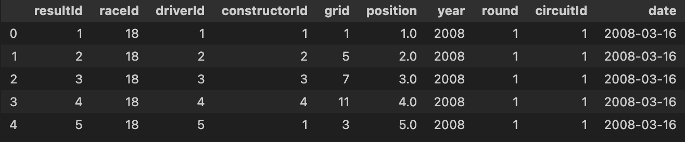
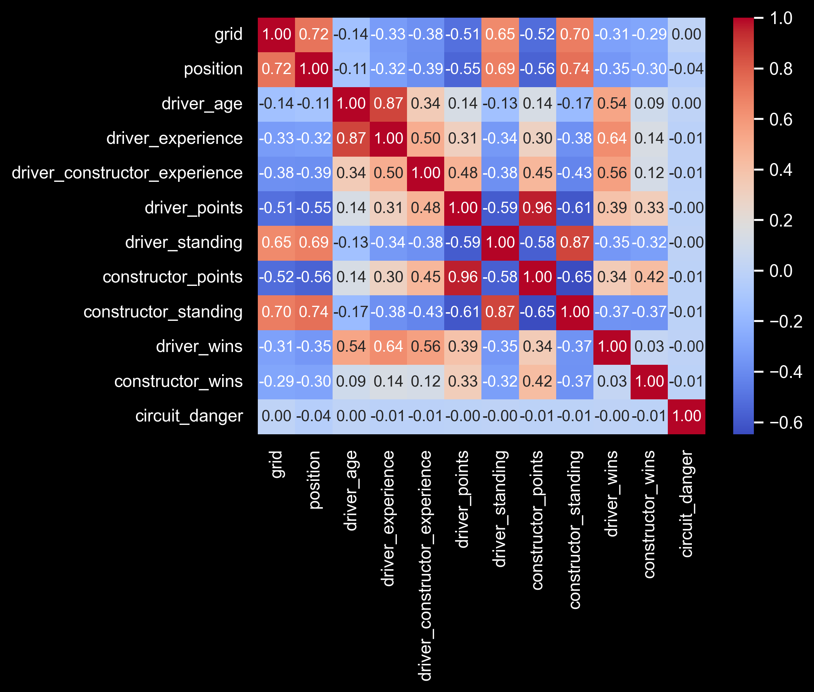
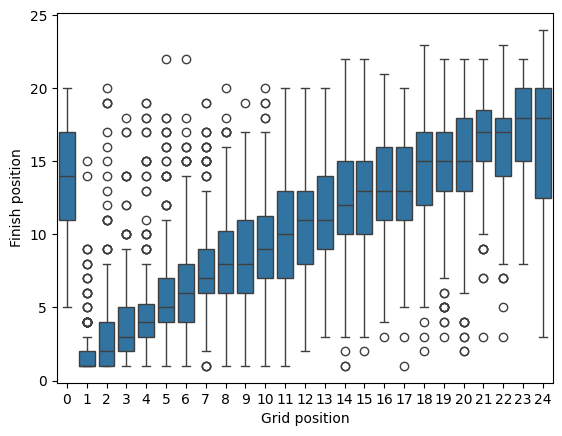
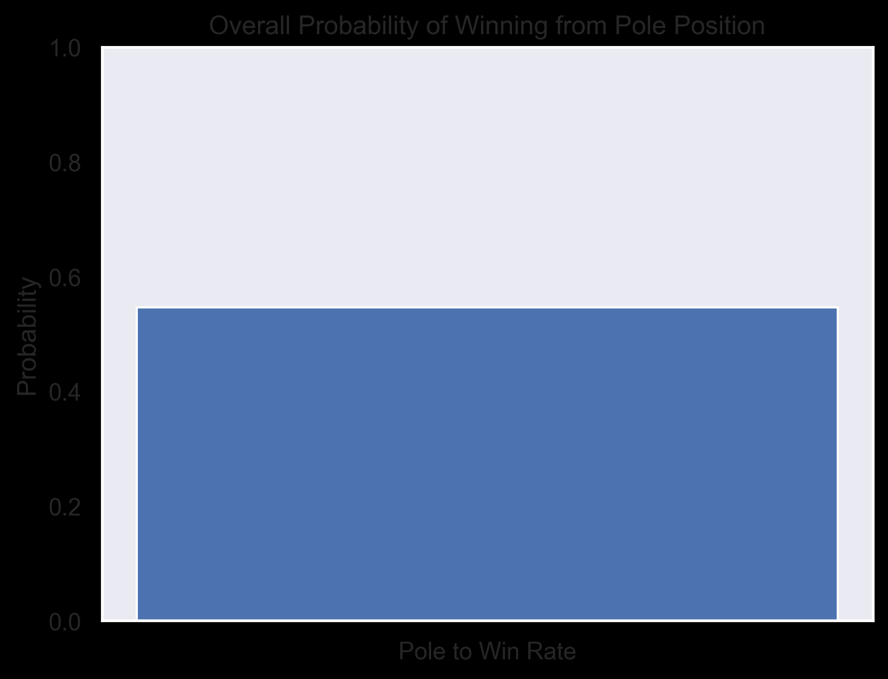
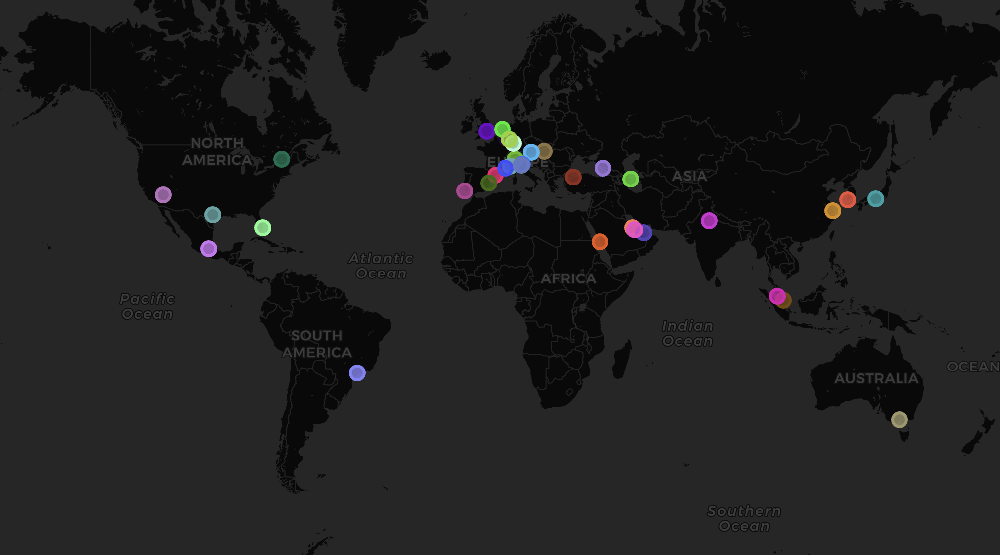
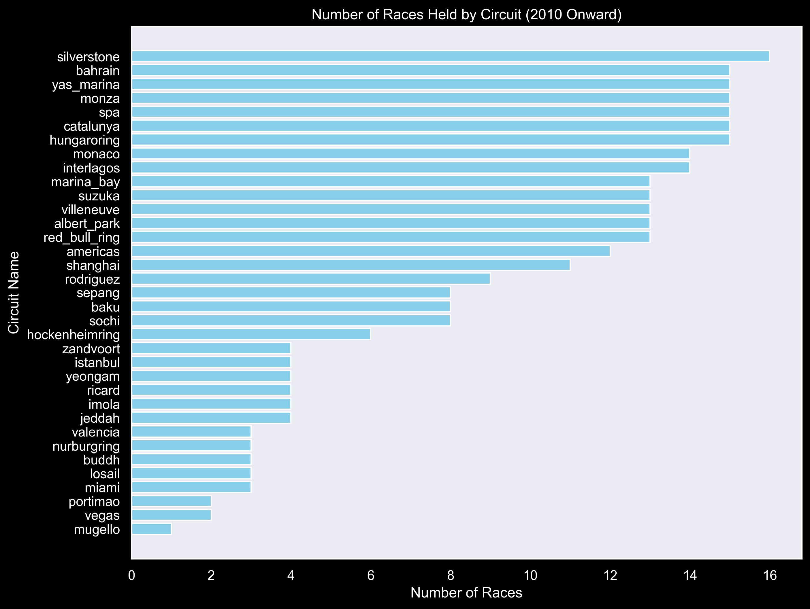
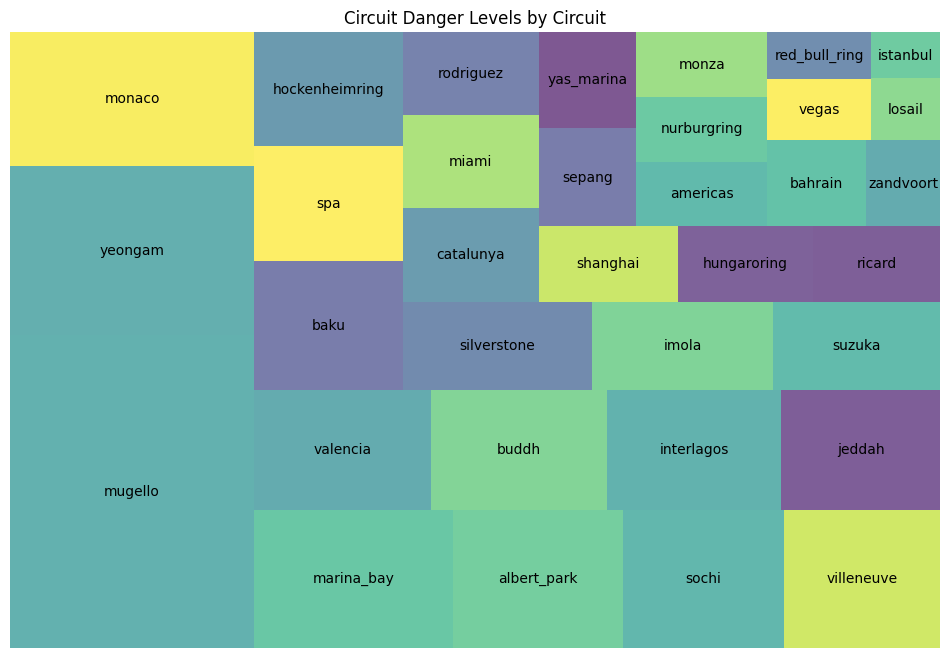
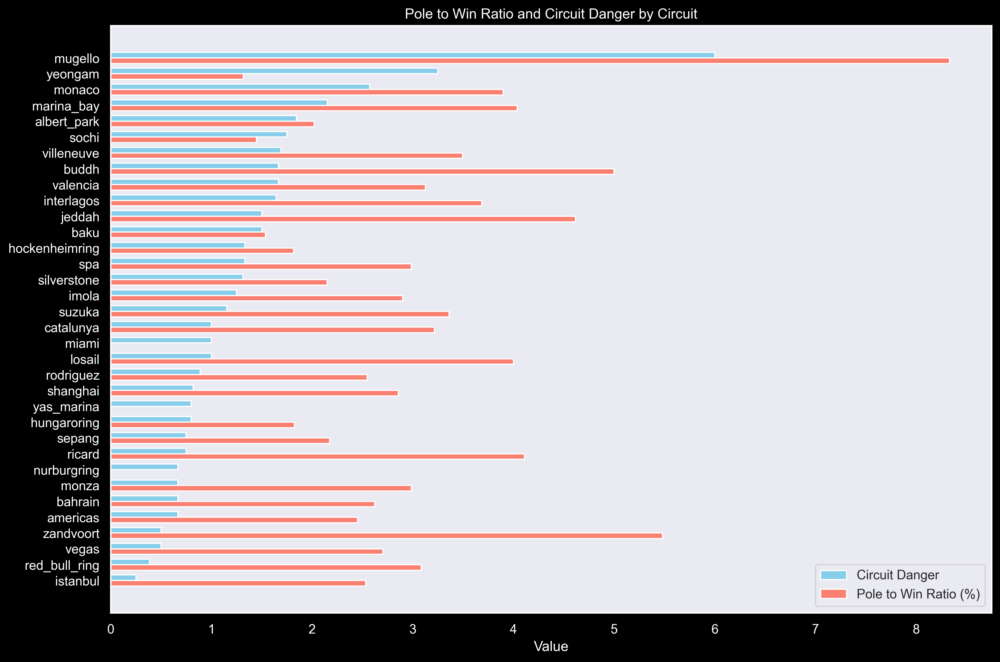
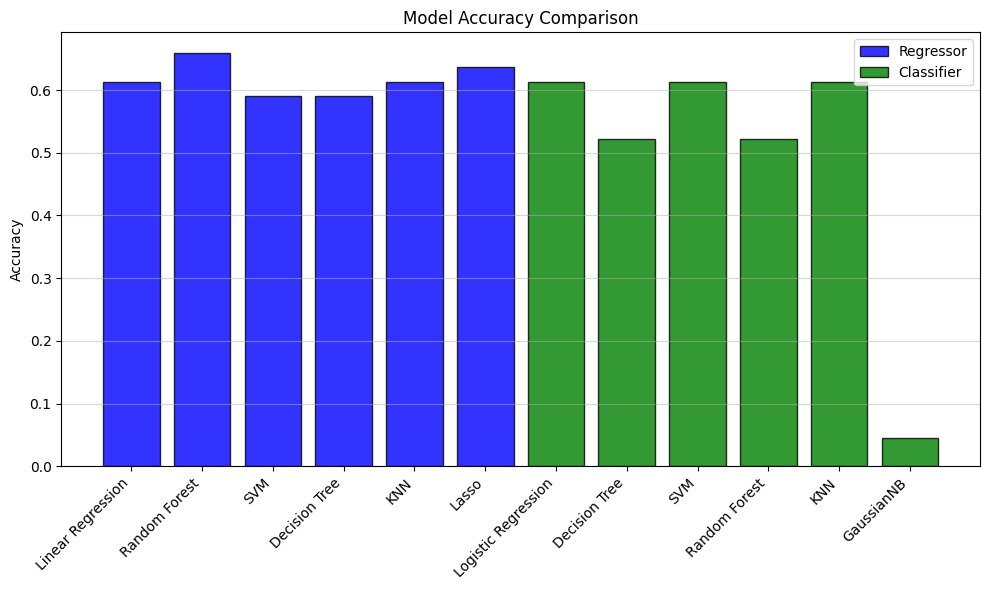

#### *Under development*
# F1-Predictions

### Motivation

My career as a Data Scientist started with motorsport: not so long ago I bought a racing simulator and that became my favorite hobby. I always like to push everything to the limit, so I asked myself, how can I do it here? How can I improve? That’s when all this “data world” came up. Turns out, a racing simulator not only simulates the real life in looks and physics, but also on data. In this case, telemetry. I found out I could analyze this data to improve my lap times, get my ideal fuel load, estimate the best lap time to pit, and so on. I loved that so much that I thought, how can I make this my career? That’s when I found out about Data Science.

So as my first Data Science project, I figured I could go back to where it all started and make it about motorsport, and of course it had to be Formula 1, right? I thought it would be fun to predict the winner of a Grand Prix, and see what variables are the most important ones for a weekend of success. I will predict the whole 2024 season and compare it to the actual results

I will divide this project into 3 major steps: **Data Collection**, **Exploratory Data Analysis** (EDA) and **Machine Learning Modeling**.

## 1. Data Collection
Here I'll explain my data source and how I used it for gathering all the information I need.

My primary source will be [Ergast API](http://ergast.com/mrd/), which is an experimental web service which provides a historical record of motor racing data for non-commercial purposes. It will be deprecated soon, but since its successor it’s still in alpha phase, for this first version of the project, I’ll stick to Ergast. One feature this API has is that it lets you download the full MySQL database image, so you can run it locally, and thats the approach I took. 

Here's a look at entity relationship diagram for the DB

First I'll start by querying the results table: I’ll fetch all foreign keys related to tables we'll need to get data from, plus the grid position. I'll join that with the race table to get other foreign keys plus the year, round, and date of the race. 

That will be my base table, based on that, I’ll start adding more columns that will help me later, like driver’s age, experience, experience with current team, all time wins, all time wins with current team, points, and more. Then to make this simpler, I’ll filter the data from 2010 onwards, because that is the last major change in F1’s point system. In the future I may consider all the data from 1950 and try to convert it to the current point system. I then dropped the 2024 season to separate it for the predictions later.

I ended up with a table with 17 columns (123 after applying one-hot-encoding). For the complete step by step, refer to the [Data Collection Notebook](Data-collection/Data_Collection.ipynb). 

## 2. Exploratory Data Analysis

For this step, I’d like to start explaining all the columns that will be mentioned:
- `grid`: Starting position
- `position`: Finishing position (this one is the one that I want to predict)
- `driver_age`: Driver age at the time of the race
- `driver_constructor_experience`: Driver experience with current team until that race
- `driver_points`: Driver’s points before the start of the race
- `driver_standing`: Driver’s standing in the championship before the start of the race
- `constructor_points`: Driver’s current team points before the start of the race
- `constructor_standing`: Driver’s current team standing in the championship before the start of the race
- `driver_wins`: Driver’s total wins in F1 at the time of the race
- `constructor_wins`: Driver’s current team total wins in F1 at the time of the race
- `circuit_danger`: How prone are accidents in that circuit. Comes from dividing amount of total crashes in that circuit divided by the amount of races that circuit held.
  
I want to start by creating a heat map between all this variables to see how correlated they are.

This gives us a good idea of how the different variables affect each other. Since I’ll be trying to predict position, we can see the one that has the most impact is grid. So let’s compare them in a Box Plot. Note that grid 0 is used for a pit lane start.

 

So the chances of getting a win from pole (grid==1) are really high. In fact, here’s a chart of the overall probability of winning from pole position.

More than 50% chance of winning a race if the starting position is the pole.

Are circuits related to this? Formula 1 hosted GPs in many different circuits over the years, which they also changed the layouts of. Here’s a map of all the circuits that hosted races since 2010.

It’s important to say that some circuits hosted only 1 race, like Mugello, where others like Silverstone hosted 16. Here’s a chart that shows the number of races held by each circuit.

All of them are different. Some are permanent racing venues, while others are street circuits. Both are really different, but sometimes people may say that in some circuits like Monaco, pole position is the key to a win, mainly because of how narrow and difficult it is to overtake. Let’s see how different the pole-to-win ratio is varied by circuit, where the bigger squares represent the higher chance of converting a pole into a win.

Does this have anything to do with accidents? Let’s see how they compare based on how prone accidents are to each circuit. 

We can see some similarities in the last 2 graphics. Is it possible that how prone a circuit is to accidents leads to a higher chance of converting a pole into a win?

We can see there is no correlation between the two variables.

## 3. Machine Learning Modeling

To start, is this a Regression or Classification problem? Depending on the approach, we can adopt either. I will do both and keep the most accurate model. 

For a Regression approach, we can predict `position` and keep the lowest value in a given race, and that would be the winner. On the other hand, for classification, it will be predicting the winner, and if it predicts more than 1, I'll chose the one with the highest probability.

After some model training, these are the results:

As we can see, all models with the exception of Naïve Bayes (Shown as GaussianNB), perform with an accuracy of around 60%, with `Random Forest Regressor` being the highest with 66%, using both the 2023 and 2024 seasons as test sets.